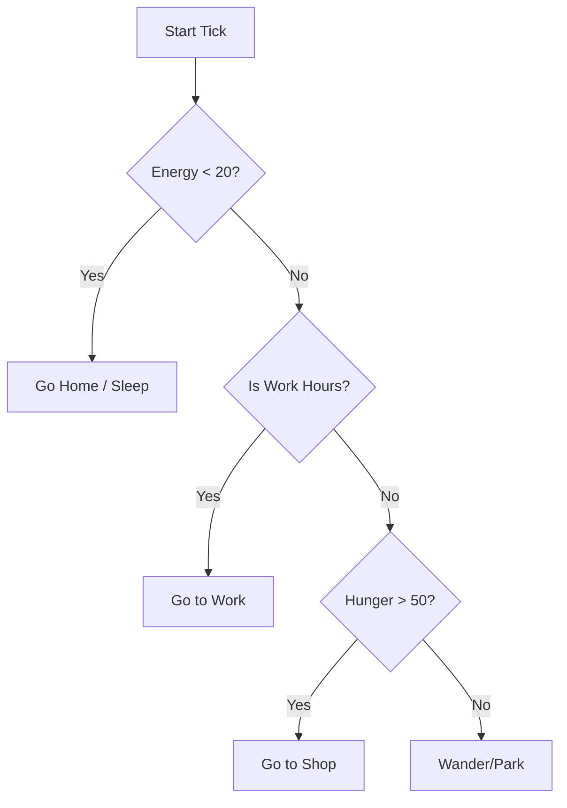

## 🏗️ RatRace Architecture Design Document

### 1. The Tech Stack

* **Bundler:** Vite (Fast HMR is essential for tweaking sim parameters).
* **UI Layer:** React (For HUD, menus, and inspector panels).
* **Rendering:** HTML5 Canvas (To handle hundreds of agents without DOM overhead).
* **State Management:** `Zustand` or `Valtio` (Great for high-frequency updates outside the React render cycle).

---

### 2. Core Simulation Loop (The Engine)

To prevent the UI from lagging, the simulation should run on a fixed time step.

* **Tick Rate:** 60 ticks per second.
* **World Time:** 1 real second = 1 game hour.
* **Global State Object:**
```javascript
{
  time: 0,        // 0 to 2400
  day: 1,
  economy: { inflation: 1.0, totalWealth: 5000 },
  entities: { agents: [], buildings: [], paths: [] }
}

```


---

### 3. Agent Design (The "Citizens")

Each Agent is a state machine. Instead of "teleporting," they must physically traverse the canvas.

**Key Properties:**

* `id`: Unique ID.
* `pos`: `{x, y}` coordinates.
* `wallet`: Current cash.
* `stats`: `{ hunger, energy, happiness }`.
* `homeId` / `workId`: References to building objects.
* `state`: `IDLE`, `MOVING_TO_WORK`, `WORKING`, `SHOPPING`, `SLEEPING`.

**The Decision Logic:**



---

### 4. Urban Infrastructure (The Map)

The city is a grid of **Tiles**.

* **Residential:** Generates Agents. Provides "Sleep" recovery.
* **Commercial:** Consumes "Stock." Provides "Food/Items." Subtracts `wallet`.
* **Industrial:** Generates "Stock" for shops. Provides "Jobs." Adds `wallet`.
* **Roads:** Agents move $2\times$ faster on road tiles.

---

### 5. UI & Interaction (The React Layer)

The Canvas handles the "World," but React handles the "Information."

* **The HUD:** Top bar showing World Time, Total Population, and City Treasury.
* **The Inspector:** Clicking an Agent on the canvas selects them. React displays their "Thought Bubble" (e.g., *"I'm starving and my boss is a jerk"*).
* **The Build Menu:** Buttons to paint roads or zone areas.

---

### 6. Technical Implementation Strategy

#### A. The "World Provider" (Zustand)

Use a store to keep track of the simulation data. React components subscribe to this to show stats.

#### B. The Canvas Renderer

Use a `requestAnimationFrame` loop.

1. **Clear:** `ctx.clearRect()`.
2. **Draw Grid:** Render tiles (colors: Green for Res, Blue for Comm, Yellow for Ind).
3. **Draw Agents:** Simple circles. Color code them by state (e.g., Red = Hungry, Blue = Sleeping).
4. **Update Logic:** Run the movement and stats calculation.

#### C. Pathfinding

Since it's a grid, use a simple **A* (A-Star)** algorithm. To save performance, Agents should only calculate their path once when their destination changes, not every tick.

---

### 7. Expansion Milestones

1. **Phase 1:** Agents move from Point A (Home) to Point B (Work) and back based on a clock.
2. **Phase 2:** Implement the `wallet` and `shop` logic. If `wallet === 0`, they can't shop.
3. **Phase 3:** Add "Traffic." If too many agents are on one road tile, their speed $V$ decreases:

$$V_{actual} = V_{max} \times (1 - \frac{agents}{capacity})$$


4. **Phase 4:** Add "Life & Death." New agents move in, old ones... move out to a "digital retirement home."

---
